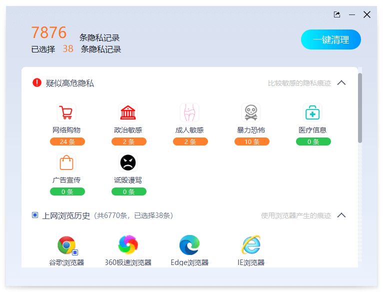

[English](README_en.md) | 简体中文

 

    
    
    

## 📣 简介
极智C盘清理，一款完全免费、轻便可信赖、简单易用的系统清理软件，可一键清理C盘垃圾、加速内存、整理文件碎片、清理隐私痕迹，保持电脑干净清爽。 同时，还提供微博热搜、数据恢复等各种工具，提升办公效率。

    

## 🌟 特性
- 垃圾清理、C盘瘦身、系统扩容
智能扫描清理系统垃圾,对C盘全面瘦身，让你的系统更加干净清爽，腾出更多存储空间。

    

- 热搜资讯、吃瓜达人、与时俱进
实时热搜，可快速查看微博热搜、知乎热榜、抖音热榜等热搜资讯，即刻了解全网热点。

    

- 数据恢复、文件碎片整理、隐私保护
数据恢复、磁盘文件碎片整理、百宝箱、计算器、截图录屏、小红书、微信文件传输助手等辅助工具，提升您的办公效率。

    
    
    

## ⚡ 快速开始

- 安装版
前往 [极智C盘清理官网](https://cc.cpanx.com) 下载最新的安装包，然后双击安装使用即可。

- 绿色版
前往 [极智C盘清理绿色软件包下载地址](https://github.com/c-cleaner/c-cleaner/releases) 下载最新的绿色压缩包，然后解压，再双击启动主程序 ***CPanx.exe*** 文件即可使用。

## 📖 用户反馈、技术交流、商务合作

- 相关商务合作、产品问题反馈、技术交流等需求，可进入 [极智人生用户反馈QQ群](https://qm.qq.com/q/CkEX6hUMMg) 进行交流咨询。
- 或者发送邮件到邮箱进行沟通：lifetech996@163.com 。

## 👀 效果展示

    

## 🚀 官网
更多详情可移步
[极智C盘清理官网](https://cc.cpanx.com)
进行了解。
