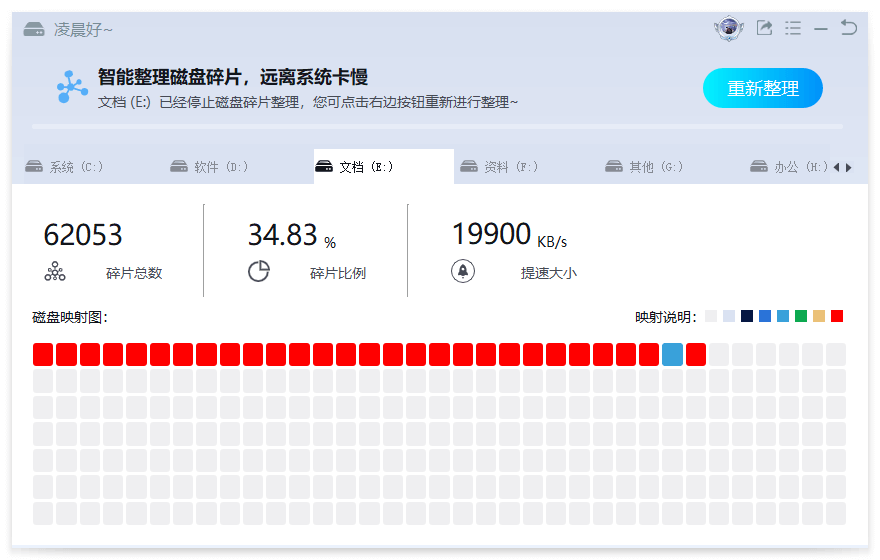
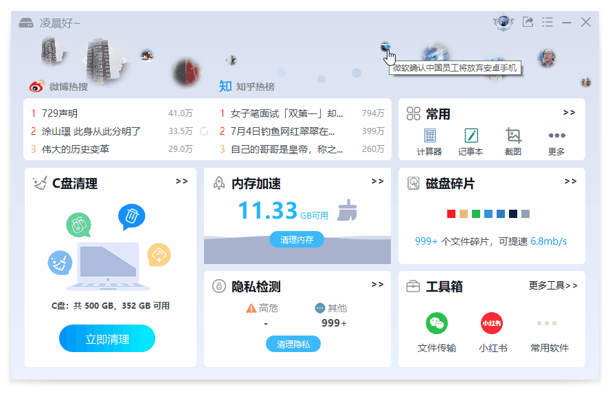

English | [简体中文](README.md)

 

    
    
    

## 📣 Introduction

C-Cleaner is a lightweight and reliable system cleaning software that can easily clean up system junk files, accelerate memory, disk defrag, and clear privacy traces, keeping the computer clean and efficient. At the same time, it also provides various tools such as Weibo hot search and data recovery to improve office efficiency.

    

## 🌟 Features

- clean up junk files
Intelligent scanning and cleaning of system junk, making your system cleaner and fresher, freeing up more storage space.

    

- hot news
Real time hot news. You can quickly view the hot news such as Weibo, Zhihu, Tiktok, and instantly understand the hot news of the whole network.

    

- data recovery, defrag, privacy protector
Assist tools such as data recovery, defrag, toolbox, calculator, screen-capture, screen-recorder, Xiaohongshu, WeChat file transfer, etc to improve your office efficiency.

    
    
    

## ⚡ Quick Experience

- installation package
Go to the  [official website of C-Cleaner](https://cc.cpanx.com)  to download the latest installation package, then double-click to install and use it.

- portable package
Go to the  [release url address](https://github.com/c-cleaner/c-cleaner/releases)  to download the latest portable package, then unzip it, and double-click to start the main program file(CPanx.exe) to use.

## 📖 Technical Exchange And Cooperation
- For business cooperation, product issue feedback, technical exchange, and other needs, please send an email to email for communication.
- The email is lifetech996@163.com.

## 👀 Visualization

    

## 🚀 Official Website

More details can be found on  [official website of C-Cleaner](https://cc.cpanx.com).